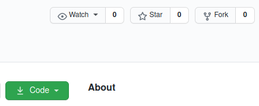

# Primeira Fase Processo Seletivo - Talus Insper

- [1. Sobre o desafio](#sobre-o-desafio)
    - [1.1. Tutorial de Python](#tutorial-python)
    - [1.2. Desafio](#desafio)
- [2. Instruções para usar o git](#instrucoes-git)
    - [2.1. Como forkar esse repositório](#fork-repositorio)
    - [2.2. Como clonar o repositório](#clonar-repositorio)
    - [2.3. Subindo suas modificações](#push-repositorio)
- [3. Instruções sobre o Jupyter Notebook](#instrucoes-jupyter)
- [License](#license)

## 1. Sobre o desafio

Boas-vindas, programadores! Este é o primeiro processo seletivo da Talus Insper, queremos proporcionar a vocês uma experiência única e que você possa retirar algum aprendizado desse processo.

Você já ouviu falar sobre isso, então agora sejamos diretos e vamos explicar essa primeira fase.

### 1.1. Tutorial de Python

Nesse repositório você pode achar um tutorial de Python com o nome *PS - Talus Insper - 2020.2 - Tutorial.ipynb*, garantimos que este tem todo o básico para a resolução do desafio, mas isso não significa que você não vai precisar pesquisar e testar coisas por conta própria. Essa é uma qualidade muito importante que procuramos.

### 1.2. Desafio

O Desafio de programação com as instruções estão no arquivo *PS - Talus Insper - 2020.2 - Desafio.ipynb*, só iremos considerar o que for modificado neste. É importante frisar que iremos baixar seu arquivo no final dessa etapa (12/09) e não iremos considerar qualquer edição após esse prazo.

## 2. Instruções para usar o git

Para usar o git no terminal do computador (é a maneira que recomendamos), você irá precisar baixar o [git](https://git-scm.com/downloads) no seu computador e seguir as [instruções de instalação](https://git-scm.com/book/pt-br/v2/Come%C3%A7ando-Instalando-o-Git), usuários de Windows não terão tanto problema nessa parte.

Claro, você também precisa possuir uma conta no [GitHub](https://github.com/).

### 2.1. Como forkar esse repositório

Atenção, essa parte é __MUITO__ importante e, caso não cumpra com ela, você não estará participando do processo seletivo.

Como dito em nossas redes sociais, nosso processo seletivo não tem inscrição. Você precisará fazer um fork desse repositório, basicamente, você irá criar uma cópia deste no seu perfil do GitHub e assim poderá modificá-lo e subir as suas modificações.

Para isto, basta clicar no botão de fork que existe nesse repositório. Ao fazer isto, o GitHub irá salvar seu usuário em nosso repositório. Mas isso não elimina a necessidade de você colocar seu nome e email no arquivo de desafio, como solicitado.

### 2.2. Como clonar o repositório

Uma vez que você já tenha este repositório forkado no seu perfil, entre nele, garanta que está no repositório certo, este deve ter seu nome de usuário na URL.

Copie a URL deste, abra seu terminal, viaje para uma pasta adequada e fácil de acessar e use o comando

`git clone [URL_AQUI]`

E você irá clonar, ou seja, criar uma cópia desse repositório na sua máquina. Você pode ainda baixar esse arquivo com o botão de download, mas o conhecimento de git é algo essencial na vida de um programador e que você com certeza irá usar quando você passar.

Uma vez que você tenha clonado, faça modificações livremente na sua versão.

### 2.3. Subindo suas modificações

Okay, desafio feito, agora você precisa subir isso de volta no GitHub.

Para isso, você só precisa seguir as seguintes instruções. Abra o terminal e viaje para dentro da pasta desse repositório, a mesma que você clonou anteriormente e no terminal digite

`git commit -am "[ESCREVA_UMA_MENSAGEM_AQUI]"`

Esse comando irá criar um commit (não vamos nos estressar com o que isso significa por agora) com uma mensagem sobre a modificação que foi feita. Em seguida

`git push`

Esse comando irá enviar as modificações de volta para o GitHub, se for a primeira vez que faz isso, talvez seja necessário autenticar os dados de login na sua conta. Entre em contato conosco se tiver qualquer problema.

## 3. Instruções sobre o Jupyter Notebook

Para editar os arquivos, você precisará ter o Anaconda em sua máquina, que você pode achar [aqui](https://www.anaconda.com/products/individual). Siga as [instruções de instalação](https://docs.anaconda.com/anaconda/install/).

Em seguida, abra o terminal, viaje para o clone do repositório na sua máquina e entre com o comando `jupyter notebook` para iniciar este. Agora é só selecionar o arquivo que precisa editar, no tutorial você pode achar instruções básicas de Jupyter Notebook.

## License

Este repositório e qualquer arquivo aqui contido não está protegido sobre lei nenhuma. Você pode utilizar e divulgar a vontade, entretanto, tudo que fizer com ele não é responsabilidade de nenhum dos colaboradores. E, por favor, se possível, dê os devidos créditos.